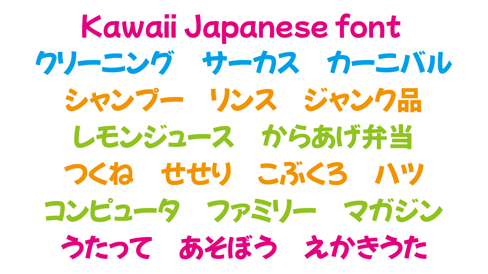
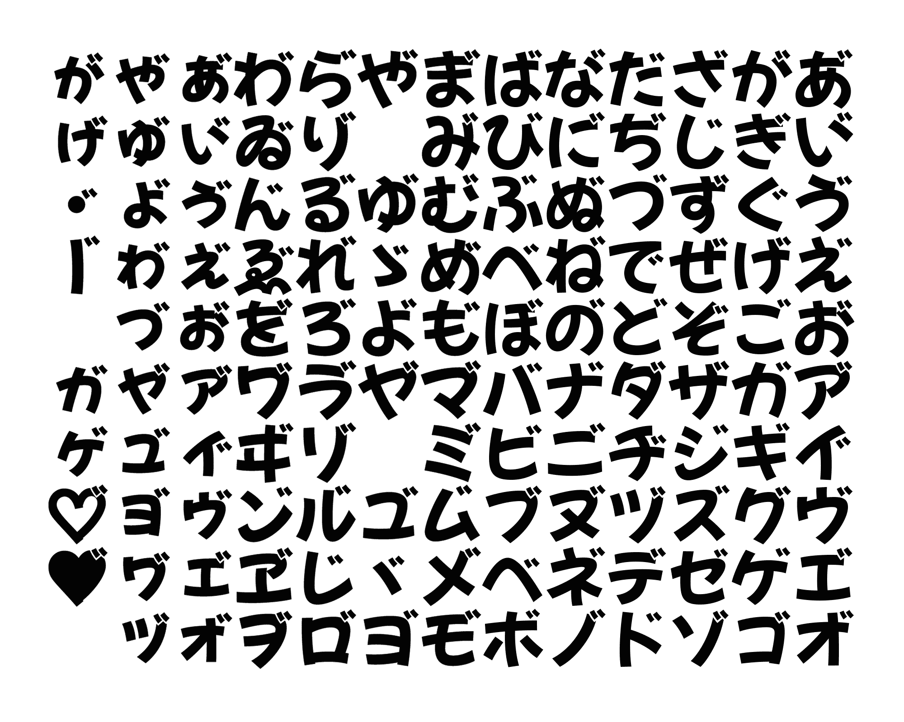
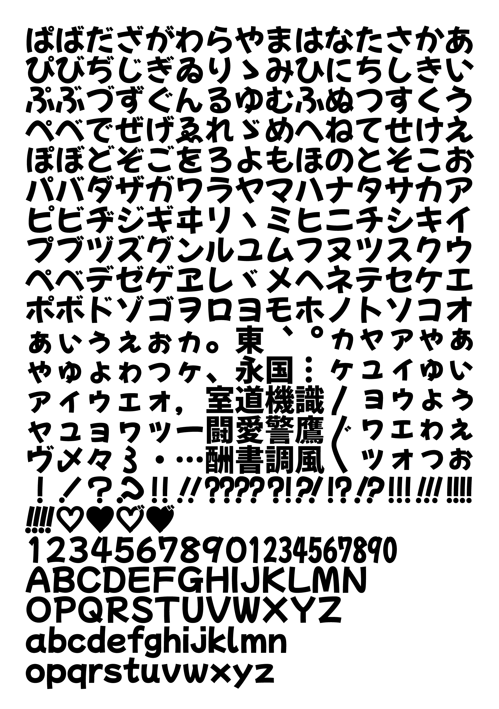

<h2>はじめに</h2>
こちらは今後GoogleFontsに提供するフォントです。 
品質向上のため、デザインについてご意見などいただけますと嬉しいです。

<h2>このフォントについて</h2>

モッチーポップは、POPや漫画に無料で商用利用も可能な女子文字ゴシック体フォントです。 女子が書いたモチモチしてコロコロ丸っこい字でポップなフォントを目指して作りました。 
職場の新卒3年目の女子にお昼休みにサインペンで書いてもらった文字を下敷きにしています。 女性社員の文字を元にする……これは、大尊敬する今田欣一さんがゴカールという書体を作られた時と同じコンセプトです。今田さんをリスペクトして私も女性社員の字を元に作ってみました。 
ver２.00では、濁点仮名の追加、基本ASCII＋Laten-1文字の追加、漢字はSILライセンスの源ノ角ゴシックの漢字を収録しました。 

<h2>濁点付き仮名を収録</h2>

同人作品等で需要のある濁点付き仮名を収録しました。 
濁点を点けたい清音（例えば「あ」）に続けて濁点「゙　」（U+3099）を隣り合わせで入力すると出せますが、アプリによっては正しく表示されないこともあります。その場合は、字形パレット等から入力してください。 

<h2>SIL Open Font License Version 1.1ライセンスについて</h2>

・個人利用・商用利用にかかわらずどなたでも無料でお使いいただけます。 

・ゲームやアプリなどへの組み込みやwebフォントとしての利用も可能です。 

・このフォントを使用し、派生フォントを作ることもできます。 
　ただし、配布の際はSIL Open Font Licenseに基づいてリリースする必要があります。 

・SILライセンスについて詳しくはライセンス原文日本語サイト 
　（https://ja.osdn.net/projects/opensource/wiki/SIL_Open_Font_License_1.1） 
　または同梱の「OFL.txt」（英語）をご確認ください。 

<h2>収録文字</h2>
・基本ASCII＋Laten-1文字 
・ひらがな、カタカナ、全角英数、全角記号、縦書き用文字、濁点仮名 
・漢字のみSILライセンスの<a href="https://github.com/adobe-fonts/source-han-sans/tree/release/SubsetOTF/JP" target="_blank">源ノ角ゴシック</a>のものを収録

<h2>字形サンプル</h2>

<h2>できないこと</h2>
・作成した派生フォントの名前に「モッチーポップ」の文字を含めることはできません。 
・「SIL Open Font License Version 1.1」以外のライセンスで再配布することはできません。 
・フォントファイル自体を単体で販売することはできません。 

<h2>その他</h2>
ご不明なことやお気付きの点がありましたら作者のメール：fontdasu@gmail.com
または<a href="https://twitter.com/fontdasu" target="_blank">作者Twitter</a>へお問い合わせください。 

<h2>更新履歴</h2>
Ver 2.000 (2020.8.17) 
Glyphsで1から作り直しました。グリフのパスを全て見直しました。濁点仮名を追加。基本ASCII＋Laten-1文字を追加。漢字はSILライセンスの源ノ角ゴシックのものを収録しました。  

Ver 1.000 (2018.10.29) 
初回リリース。

